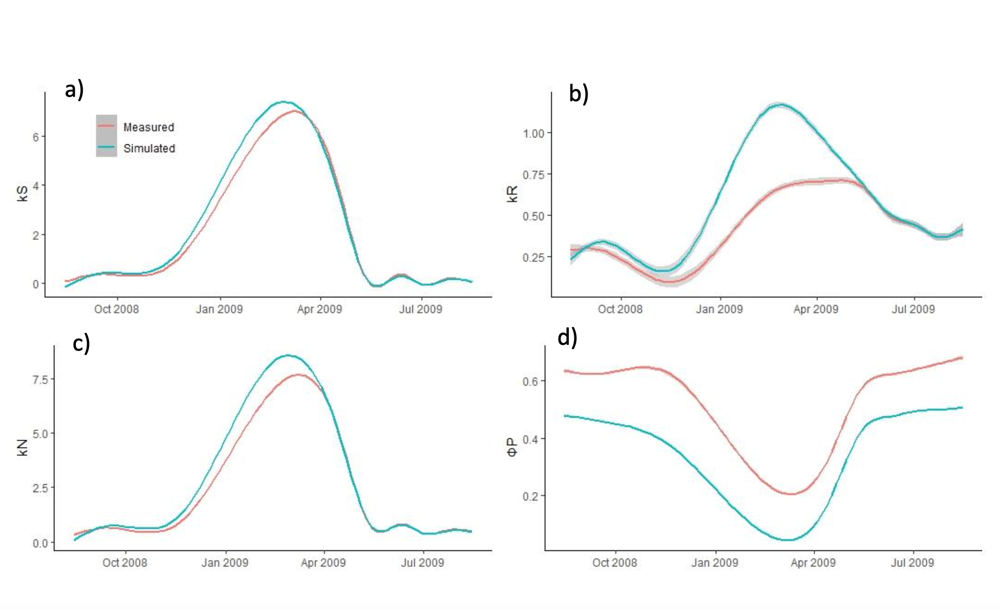

# Boreal Forest Fluorescence Modelling
A leaf scale numerical model to track photosynthetic efficiency and carbon dynamics in boreal ecosystems.

**Academic Project | AgroParisTech** 
**Authors:** Mariam Abdulsalam & Monica Rothwell 

## Project Overview
Boreal forests are critical global carbon sinks, yet they are highly vulnerable to climate change. This project focuses on creating a **numerical leaf-scale fluorescence model** to monitor photosynthetic efficiency. By using fluorescence as a proxy for Gross Primary Production (GPP), we can better estimate carbon sequestration in high-latitude ecosystems.

## Technical Implementation
- **Biophysical Modelling:** Developed a bottom up model to simulate steady state fluorescence ($F_s$).
- **Numerical Simulation:** Implemented light response curves and electron transport rate (ETR) calculations.
- **Data Analysis:** Processed complex time series data to synchronize model outputs with field observations.
- **Quenching Mechanisms:** Integration of Non Photochemical Quenching (NPQ) to account for energy dissipation under high light stress.

## Model Workflow & Parameters
The model was constructed using a rigorous biophysical framework:
* **Input Integration:** Integration of Photosynthetic Active Radiation (PAR) and temperature variables.
* **Parameterization:** Fine-tuning of $F_m$ (maximum fluorescence) and $F_0$ (minimum fluorescence) based on boreal species characteristics.
* **Validation:** Yield outputs were validated against **PAM fluorometry** field data to ensure seasonal accuracy.## Key Findings
- Successfully simulated the diurnal bell curve of fluorescence.
- Identified the importance of accounting for **seasonal acclimation** to improve model accuracy.
- Demonstrated that leaf scale modeling is essential for refining nationalscale carbon budgets (SNBC).

## Key Findings and Scientific Result

High Diurnal Correlation: The model successfully replicated the diurnal "bell curve" of leaf fluorescence, with a high degree of correlation between simulated results and PAM fluorometry field data. This confirms the model's ability to track real time photosynthetic energy conversion.

Identification of Quenching Drivers: Analysis revealed that Non Photochemical Quenching (NPQ) is the dominant regulator of fluorescence during peak solar radiation. The model accurately captured how plants protect themselves from light stress by dissipating excess energy as heat.

The Acclimation Gap: A key discovery was the divergence between the model and observations during seasonal transitions. This finding identified photosynthetic acclimation as a critical missing variable, proving that boreal trees "remember" past temperature patterns to optimize their carbon uptake.

Proxy Reliability: The results confirm that leaf scale fluorescence is a reliable proxy for Gross Primary Production (GPP), providing a robust scientific basis for monitoring the carbon sequestration potential of high latitude forests.

*Figure 1: Comparison between modeled fluorescence and PAM fluorometry observations showing the diurnal cycle of photosynthetic efficiency.*

##  Conclusion
The study successfully demonstrates that leaf-scale fluorescence is a robust indicator of photosynthetic activity. By capturing the diurnal and seasonal rhythms of boreal canopies, this model serves as a vital bridge between ground level biology and satellite scale Solar-Induced Fluorescence (SIF) observations.

## Recommendations & Future Outlook
To enhance the operational utility of this model for public policy, the following evolutions are proposed:
* **Seasonal Acclimation:** Incorporating biological memory to improve model precision during spring recovery.
* **Multi-Scale Scaling:** Expanding the model to the canopy level using 3D radiative transfer models (e.g., SCOPE) to match satellite data.
* **Stress Modules:** Adding variables for hydric stress to simulate the impact of droughts on national carbon sinks.

## Skills 
- **Numerical Modelling & Simulation**
- **Ecological Data Science (Python/R)**
- **Time Series Analysis**

